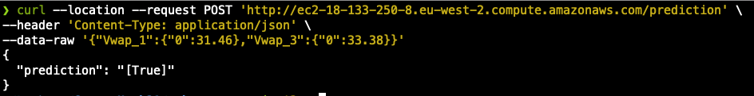

# Start_Hack21

AIenergy-innovation

## Web server

Our XGBOOST ML algorithm is avaible on a POST API. By sending a post Request with the latest VWAP (volume weight average price) of trades last trading hour before delivery start of hourly contracts and VWAP of trades last 3 trading hours before delivery start of hourly contracts the API return `True` if the price is goin up otherwise `False`.

```
curl --location --request POST 'http://ec2-18-133-250-8.eu-west-2.compute.amazonaws.com/prediction' \
--header 'Content-Type: application/json' \
--data-raw '{"Vwap_1":{"0":31.46},"Vwap_3":{"0":33.38}}'
```


